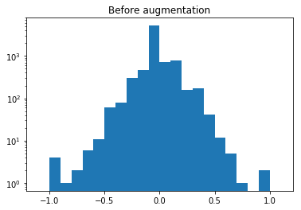
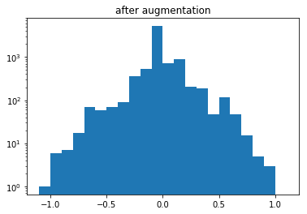

# **Behavioral Cloning** 

March 2, 2020 - John Robinson

[](http://www.udacity.com/drive)

**Behavioral Cloning Project**

**Project 4** in Udacity’s Self-Driving Car Nanodegree

---

**Behavioral Cloning Project**

The goals / steps of this project are the following:
* Use the simulator to collect data of good driving behavior
* Build, a convolution neural network in Keras that predicts steering angles from images
* Train and validate the model with a training and validation set
* Test that the model successfully drives around track one without leaving the road
* Summarize the results with a written report

My Project Repository: https://github.com/johnrobinsn/CarND-Behavioral-Cloning-P3

Included with the submission:
* model.py file used to create the models for this project.
* drive.py script used to drive the simulator autonomously.
* model.h5 model used to autonomously drive track 1.
* video.mp4 demonstrating the model.h5 successfully navigating track 1.
* model_track2.h5 model used to autonomously drive track 2.
* video_track2.mp4 demonstrating model_track2.h5 successfully navigating track 2.
* writeup report 
* This document as a project writeup.

---
## Rubric Points
### Here I will consider the [rubric points](https://review.udacity.com/#!/rubrics/1968/view) individually and describe how I addressed each point in my implementation.  

---

## Overview

This project was a bit of a revelation to me, even though I had read about similar results in the past.  It's truly amazing that given just camera images from a car along with steering measurements that you train a model to successfully and autonomously navigate a track as I was able to do.  

Using the Udacity provided simulator and my drive.py file, the car can be driven autonomously around the track by executing 
```sh
python drive.py model.h5
```

The clone.py file contains the code for training and saving the convolutional neural network. The file shows the pipeline I used for training and validating the model, and it contains comments to explain how the code works.

## Model Architecture
The model architecture that I used was very close to the architecture that I used in the last project for traffic sign classification.  Which is loosely modeled on the LeNet architecture with a few small modifications.  The keras code that I used to create the model is shown in the following code block:

```python
# Create the model used for training
model = Sequential()
model.add(Lambda(lambda x: x/255.0-0.5, input_shape=(160,320,3))) # normalize the image data
model.add(Cropping2D(cropping=((70,25), (0,0)))) # crop the top and bottom of the input images
model.add(Convolution2D(6,5,5,activation='relu')) 
model.add(MaxPooling2D())
model.add(Convolution2D(6,5,5,activation='relu'))
model.add(MaxPooling2D())
model.add(Convolution2D(6,5,5,activation='relu'))
model.add(MaxPooling2D())
model.add(Dropout(0.75))
model.add(Flatten())
model.add(Dense(128))
model.add(Dense(84))
model.add(Dense(1))  # only need a single steering output
```

The first layer of my network consists of a Lambda layer that is used to normalize the data by making it range from -0.5 to 0.5.  The input image size is 320x160.

The second layer (Cropping2D layer) of my network crops the top and bottom of the image in order to remove detail that is likely to confuse the network more than help it to learn to make appropriate steering decisions.

The next layer is the first of the convolutional layers with a 5x5 filter size and an output depth of 6.  This is followed up with a RELU activation and then a MaxPooling2D layer.

I repeat this pattern of convolutional layers two more times.

The next layer is a Dropout layer with a 75% keep probability in order to reduce the likelihood of over overfitting.

The network is then flattened in order to finish with a number of fully connected (Dense) layers going from 128 outputs down to a single float output that will be the steering output of the network given the provided image at any given point in time.

The training and validation loss were calculated using the mse (mean squared error) loss function and the ADAM optimizer (clone.py; line 106) was used.

## Approach

It was quite easy to get things set up so that you could see valiant attempts to steer the car.  But there were alot of areas on the track where the car would just go off the road and the car would tend to hug one side of the road.  One of the first things that I did was to take one of the suggestions to augment the data.  By flipping each of the images and negating the cooresponding steering measurement, I was able to increase the number of samples quite easily.  This definitely helped things and made the model less biased to drive on just one side of the road.

As I added additional data to the training set, I switched to using keras's fit_generator and a python generator for feeding in the training and validation data during the training process.  I also switched to using the sklearn train_test_split function for carving out the validation set (20% of the training data).

## Overfitting

After I had settled on the current model architecture it was not hard to overfit on the training data.  The training loss would continue to fall with additional epochs, but the validation loss would hit a low point and then start increasing with additional epochs.  I added a Dropout layer with a 75% keep probability to try and address this overfitting, but that only helped slightly.  

In the last project, it wasn't until I analyzed the training data and worked on improving it that I was able to make forward progress, so I decided to do the same here.  Looking at the captured training data, I noticed that much of the data was with very small steering angles effectively driving straight, but a minority of the data was with larger steering angles that likely indicate a steering correction needed to deal with curves or recover before going off the road.  In order to address this I decided to increase the number of samples that had larger steering measurement by using both the left and right camera images when the steering angle was above a given threshold.  When I used the left or right camera images, I applied a correction to the steering angle to compensate for the offset of the cameras.  This effectively tripled the number of samples that had large steering corrections while keeping the samples that represented driving with little correction stable.  The code used to do this can be found starting at line 25 in clone.py.  Also shown in the following code block:

```python
steering_center = float(line[3])

# create adjusted steering measurements for the side camera images
correction = 0.20 # this is a parameter to tune
steering_left = steering_center + correction
steering_right = steering_center - correction

samples.append((img_center,steering_center,False)) # image_path, measurement, flip

# if the steering angle exceeds a certain threshold use the views from the left and right
# camera to train the model to accentuate the training signal.
if abs(steering_center) > 0.33:
    samples.append((img_left,steering_left,False))
    samples.append((img_right,steering_right,False))
```

With this one change I was able to successfully navigate the track.  Here are the steering angle distributions before and after augmentation:





The model for navigating track 1 can be found in the file, model.h5.  A video of this model successfully navigating track 1 can be found in the file, video.mp4.  Here is a link to the same video on youtube.

[Track 1](https://youtu.be/JXHE4aWdYcQ)


## Track 2
Track 2 was quite challenging.  Given the much more difficult track with many more curves, inclines and a center lane line, the model that I trained solely on track 1 data was not able to deal with this new environment.  So I set out to capture additional training data from track 2.  I had originaly wanted to try and capture training data that kept to the correct lane while navigating the track, but given my lack of skill at keyboard driving, I was unable to accomplish this feat. I resorted to driving track 2 straddling the center line. 

After successfully capturing the new training data, I tried to train a single model using both track 1 and track 2 data combined, but the center lane line on track 2 caused the model to learn to drive straddling a lane line.  This caused the model to drive on the side lane lines when used on track 1.  I decided at that point to just train a separate model for track 2 using just track 2 training data.  This worked well and the resulting model was able to navigate track 2 on the first attempt, which was quite exciting.  I decided to stop at this point.  But I am interested in experimenting with getting a single model that can generalize to both tracks in the future.  In order for this to happen I think I would need a way to get better training data that kept to a single lane on track 2.

A separate model file, model_track2.h5 was created for driving track 2.  The video for track 2 can be found in the file, video_track2.mp4.  Here is a link to the same video on youtube.

[Track 2](https://youtu.be/lPizVGVKKeo)

